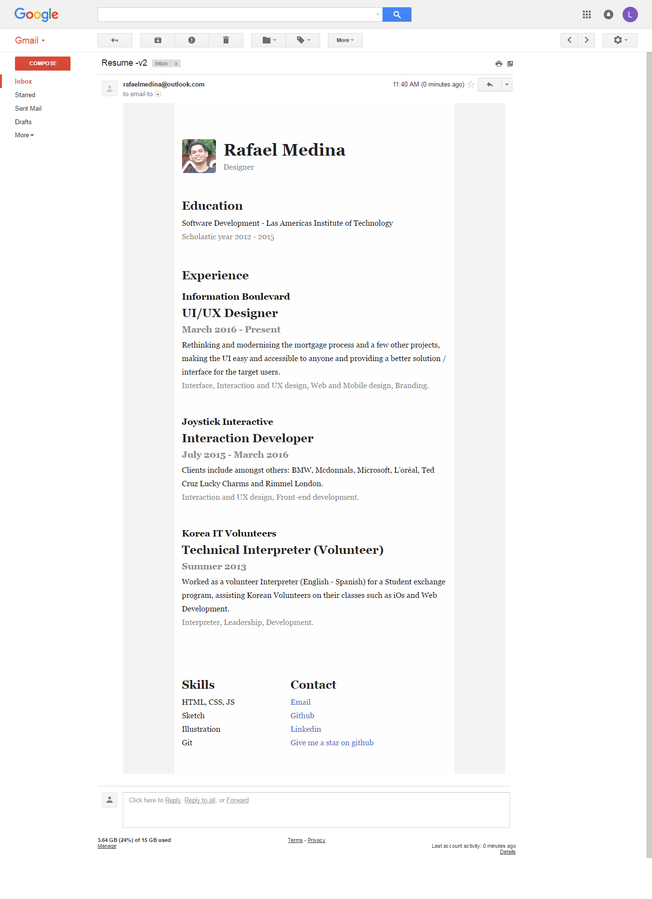

# Responsive Resume Email Template

** Preview on gmail **


** Android phone **
 (1).png)

## It has a Gulp-powered build system with these features:

- Handlebars HTML templates with [Panini](http://github.com/zurb/panini)
- Simplified HTML email syntax with [Inky](http://github.com/zurb/inky)
- Sass compilation
- Image compression
- Built-in BrowserSync server
- Full email inlining process

## Installation

To use this template, your computer needs [Node.js](https://nodejs.org/en/) 0.12 or greater. The template can be installed with the Foundation CLI, or downloaded and set up manually.

### Using the CLI

Install the Foundation CLI with this command:

```bash
npm install foundation-cli --global
```

Use this command to set up a blank Foundation for Emails project:

```bash
foundation new --framework emails
```

The CLI will prompt you to give your project a name. The template will be downloaded into a folder with this name.

### Manual Setup

To manually set up the template, first download it with Git:

```bash
git clone https://github.com/zurb/foundation-emails-template projectname
```

Then open the folder in your command line, and install the needed dependencies:

```bash
cd projectname
npm install
```

## Build Commands

Run `npm start` to kick off the build process. A new browser tab will open with a server pointing to your project files.

Run `npm run build` to inline your CSS into your HTML along with the rest of the build process.
